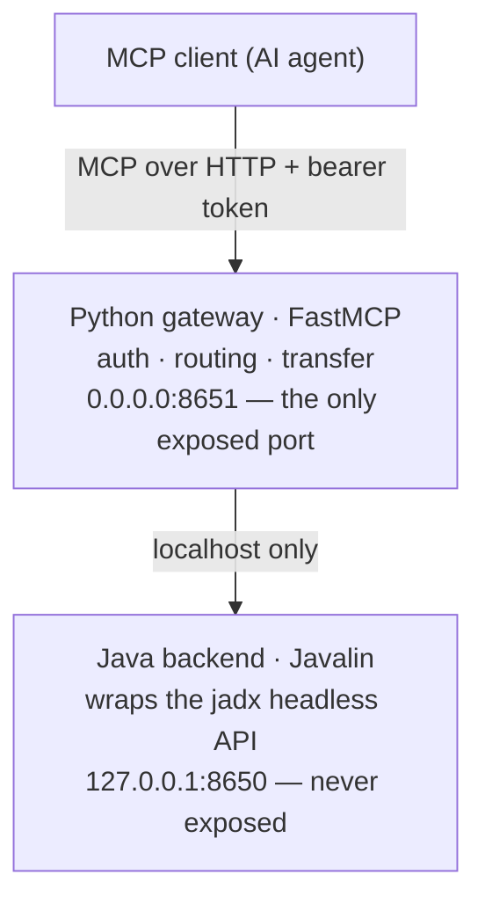

**English** · [简体中文](README.zh-CN.md)

# delamain

> Leave the reversing to us.

[](LICENSE)
[](https://github.com/xjoker/delamain/releases/latest)
[](https://github.com/xjoker/delamain/actions/workflows/ci.yml)
[](https://github.com/xjoker/delamain/actions/workflows/release.yml)
[](https://github.com/xjoker/delamain/pkgs/container/delamain)
[](https://github.com/xjoker/delamain/releases)

> [!WARNING]
> **Early development.** delamain is young and moving fast. MCP tool names and
> signatures, response shapes, config keys, endpoints, and internal architecture
> may change **significantly** between releases — without notice or
> backward-compatibility shims. Pin a version tag for reproducibility and expect
> breaking changes until the project stabilizes.

**delamain** is an **MCP server** that exposes the full power of
[JADX](https://github.com/skylot/jadx) to AI agents — a **headless,
high-performance, low-memory bridge for AI-driven Android reverse
engineering**.

`JADX` · `MCP (Model Context Protocol)` · `Android reverse engineering` ·
`APK / DEX / AAB decompiler` · `AI agents` · `headless` · `Frida`

---

## What is this?

delamain lets an AI agent *drive* JADX. Point it at an APK (or any other input
jadx accepts) and the agent can decompile classes, search code and strings,
trace cross-references, call graphs and data flow, inspect resources and the
manifest, generate Frida hooks, run security scans, and rename/annotate — all
through **MCP tools designed for AI consumption**, not for a human clicking a
GUI.

It is the headless engine only: delamain does **not** ship its own analysis
"intelligence". The AI is the analyst; delamain is its instrument.

## Supported inputs

delamain wraps jadx directly, so it accepts what jadx accepts:

- **Android apps and their distribution formats** — `.apk`, `.apks`, `.xapk`,
  `.apkm`, `.aab` — **loaded and tested**. This is delamain's first-class target.
- **Other JVM bytecode formats jadx supports** — `.jar`, `.dex`, `.aar`,
  `.class`, `.zip` — decompile through jadx.

Note on scope: the **decompilation / search / xref** core works on any of the
inputs above, but delamain's **higher-level tooling** (Android manifest,
resources, Frida hook generation, attack-surface / security scan) is
**Android-specific**, and testing focuses on Android/APK. Plain JVM inputs
(e.g. a `.jar`) decompile fine via jadx but are not the current focus.

## Why delamain (instead of driving jadx yourself)?

- **AI-optimized tool surface.** Every tool returns **bounded, paginated**
  output so it never floods the model's context window. Graph traversals carry
  hard node/depth budgets and a `truncated` flag. `get_class_source` reports a
  `decompile_quality` signal so the agent knows when to fall back to smali.
- **Headless & memory-bounded.** Runs on servers, CI, or edge boxes with no
  display server. Decompiled source and the content index live on disk (an
  mmap-backed sharded index plus a persistent CodeStore), so heap tracks the
  loaded class tree instead of re-holding everything. Memory scales with corpus
  size: a very large (~238K-class) app holds a steady ~10 GB and wants a
  12–16 GB host; typical apps need far less. The heap ceiling is **derived from
  the container's own cgroup limit at startup** (no hardcoded `-Xmx`, and no
  sizing against the host when the container is unbounded), with graceful
  low-heap degradation on smaller machines; `JAVA_OPTS` overrides it.
- **Out-of-band file upload.** Hand a large APK to the server directly — its
  bytes never pass through the AI's context window.
- **One fused container, one exposed port.** Simple and safe to deploy.

## Performance

On a large production APK (~238K classes), delamain sustains **0% 503 errors** across
concurrency, where a GUI-mode baseline (a JADX-GUI-backed MCP server) sheds `smali`
requests (28–44% 503) and can't serve class-level `xref` at all under load (100% 503).
Cached `class_source` P50 is ~5 ms and class-level `xref` ~2.7 ms; a persisted index makes
hot restart **~40 s — about 26× faster** than a cold warmup, and steady state holds ~10 GB
heap on 238K classes with **0 OOM**.

Full methodology, tables, and caveats: the
[**Performance**](https://github.com/xjoker/delamain/wiki/Performance) wiki page.

## Architecture



The Java backend (`com.zin.delamain`) wraps jadx's headless `JadxDecompiler`
and owns decompilation, indexing, and search. The Python gateway is the single
externally reachable surface: it authenticates MCP clients, proxies calls to the
backend, and streams out-of-band file uploads. Both ship in one fused Docker
image. See [`docs/architecture-reference.md`](docs/architecture-reference.md).

## Quick start (Docker)

```bash
# 1. Put the APK(s) you want to analyze in a directory, e.g. /data/apks
# 2. Set at least one MCP client token (comma/newline separated whitelist)
export DELAMAIN_AUTH_TOKENS="$(openssl rand -hex 32)"

docker compose pull        # pull the prebuilt image from GHCR (omit to build locally)
docker compose up -d       # exposes 127.0.0.1:8651

curl -s http://127.0.0.1:8651/health
# → {"status":"healthy","version":"…","jadx_version":"1.5.6"}
```

Point your MCP client at `http://<host>:8651/mcp` with the bearer token above.
Then `load_file` an APK from the mounted directory (or push one via the
[out-of-band upload flow](docs/file-upload.md)) and start analyzing.

For building from source and the developer workflow, see
[`docs/dev-guide.md`](docs/dev-guide.md).

## Install with an AI assistant

Hand this repository (or just this section) to an AI coding agent and say
*"install delamain and connect me."* The agent should follow this deterministic SOP.

**Goal:** a running delamain container on `127.0.0.1:8651`, with the caller's MCP
client configured to reach it.

1. **Preconditions** — confirm Docker is running (`docker info`), and pick an
   absolute host directory holding the APK/DEX/AAB files to analyze (e.g. `~/apks`).
2. **Generate the MCP token** (the client's bearer secret — keep it):
   ```bash
   export DELAMAIN_AUTH_TOKENS="$(openssl rand -hex 32)"
   ```
3. **Run the published image** (pin a version tag for reproducibility instead of `latest`):
   ```bash
   docker run -d --name delamain \
     -p 127.0.0.1:8651:8651 \
     -v /ABS/PATH/TO/apks:/apks \
     -e JADX_FILE_ROOT=/apks \
     -e DELAMAIN_AUTH_TOKENS="$DELAMAIN_AUTH_TOKENS" \
     --log-opt max-size=10m --log-opt max-file=3 \
     ghcr.io/xjoker/delamain:latest
   ```
4. **Verify health** (retry until `status:healthy`):
   ```bash
   curl -s http://127.0.0.1:8651/health
   # → {"status":"healthy","version":"…","jadx_version":"1.5.6"}
   ```
5. **Connect the MCP client** — streamable-HTTP endpoint + bearer token:
   - Endpoint: `http://127.0.0.1:8651/mcp`
   - Header: `Authorization: Bearer <the DELAMAIN_AUTH_TOKENS value>`

   Illustrative client config (adapt to your MCP client's format):
   ```json
   {
     "mcpServers": {
       "delamain": {
         "type": "http",
         "url": "http://127.0.0.1:8651/mcp",
         "headers": { "Authorization": "Bearer <token>" }
       }
     }
   }
   ```
6. **Confirm tools are live** — an unauthenticated `/mcp` request must return `401`;
   an authenticated `tools/list` must return the tool set.
7. **First analysis** — drop an APK in the mounted dir, then over MCP call
   `load_file_tool(path="app.apk")`, poll `get_decompile_status()` until ready, then
   use `search_classes_by_keyword`, `get_class_source`, `get_xrefs`, and friends.

**If something fails**
- `DELAMAIN_AUTH_TOKENS must be set` → step 2 wasn't exported into the `docker run`.
- Port 8651 already in use → remap (`-p 127.0.0.1:9651:8651`) and update the endpoint.
- `/health` never healthy → `docker logs delamain`; large APKs warm up in the
  background, so poll `get_warmup_status` before heavy calls.
- `401` on every call → the client's bearer doesn't match a `DELAMAIN_AUTH_TOKENS` value.

## Companion CLI: `delamain-cli`

For APKs too large to sit in the mounted directory, delamain ships an optional
resumable, chunked, checksummed uploader that streams file bytes straight to the
server (never through the AI's context). Grab a prebuilt binary for your platform
from the [Releases](https://github.com/xjoker/delamain/releases) page, or build
from source:

```bash
cd tools/delamain-cli
cargo build --release   # binary at target/release/delamain-cli
```

Usage and the full transfer flow (pairing it with the `create_transfer_token`
MCP tool) are documented in [`docs/file-upload.md`](docs/file-upload.md) and
[`tools/delamain-cli/README.md`](tools/delamain-cli/README.md).

## Configuration

Configuration comes from environment variables and/or an optional `config.toml`
(env wins). Copy [`config.toml.example`](config.toml.example) to get started.

| Key | Purpose |
| --- | --- |
| `DELAMAIN_AUTH_TOKENS` | MCP client token whitelist (required). Any token in the list grants full access — treat each as a shared secret, ≥32 random chars. |
| `JADX_FILE_ROOT` | Sandbox root for `load_file` and uploads (default `/apks` in the image). |
| `JADX_TRANSFER_MAX_MB` | Max size of an out-of-band upload (default 1024). |
| `JADX_CACHE_MAX_GB` | LRU quota for the on-disk decompile-index cache (default 50; `0` disables eviction). |

## Tool overview

delamain exposes tools across: **decompilation** (class/method source, smali,
`decompile_with_mode`, `get_decompile_diag`), **search** (class/method/field,
string literals, native methods, indexed code search), **graph analysis**
(xrefs, caller/callee chains, call-graph export, data-flow tracing),
**resources** (manifest, resource files/ids, config strings), **Frida**
(hook/trace/enum generation — always emitting *raw* obfuscated names),
**security** (attack surface, security scan), **refactoring** (rename,
ProGuard/rename mappings), **sessions & annotations**, and **file transfer**.

Call `get_jadx_guide(verbose=True)` from a client for the full workflow guide.

## Bundled jadx

delamain bundles **jadx-all** (the [jadx](https://github.com/skylot/jadx)
decompiler), which is licensed under Apache-2.0, © skylot and contributors. See
[`NOTICE`](NOTICE). delamain uses jadx's public and internal headless APIs; it
is an independent project and is not affiliated with or endorsed by the jadx
authors.

## License

Licensed under the [Apache License 2.0](LICENSE).
