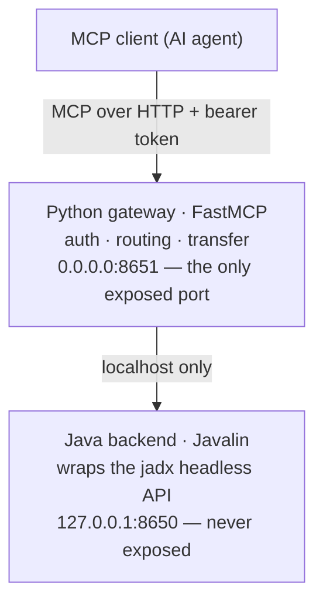

# delamain

> Leave the reversing to us.

[](LICENSE)

**delamain** is an **MCP server** that exposes the full power of
[JADX](https://github.com/skylot/jadx) to AI agents — a **headless,
high-performance, low-memory bridge for AI-driven Android reverse
engineering**.

`JADX` · `MCP (Model Context Protocol)` · `Android reverse engineering` ·
`APK / DEX / AAB decompiler` · `AI agents` · `headless` · `Frida`

---

## What is this?

delamain lets an AI agent *drive* JADX. Point it at an APK (or any other input
jadx accepts) and the agent can decompile classes, search code and strings,
trace cross-references, call graphs and data flow, inspect resources and the
manifest, generate Frida hooks, run security scans, and rename/annotate — all
through **MCP tools designed for AI consumption**, not for a human clicking a
GUI.

It is the headless engine only: delamain does **not** ship its own analysis
"intelligence". The AI is the analyst; delamain is its instrument.

## Supported inputs

delamain wraps jadx directly, so it accepts what jadx accepts:

- **Android apps and their distribution formats** — `.apk`, `.apks`, `.xapk`,
  `.apkm`, `.aab` — **loaded and tested**. This is delamain's first-class target.
- **Other JVM bytecode formats jadx supports** — `.jar`, `.dex`, `.aar`,
  `.class`, `.zip` — decompile through jadx.

Note on scope: the **decompilation / search / xref** core works on any of the
inputs above, but delamain's **higher-level tooling** (Android manifest,
resources, Frida hook generation, attack-surface / security scan) is
**Android-specific**, and testing focuses on Android/APK. Plain JVM inputs
(e.g. a `.jar`) decompile fine via jadx but are not the current focus.

## Why delamain (instead of driving jadx yourself)?

- **AI-optimized tool surface.** Every tool returns **bounded, paginated**
  output so it never floods the model's context window. Graph traversals carry
  hard node/depth budgets and a `truncated` flag. `get_class_source` reports a
  `decompile_quality` signal so the agent knows when to fall back to smali.
- **Headless & low-memory.** Runs on servers, CI, or edge boxes with no display
  server. An mmap-backed sharded index plus a persistent on-disk CodeStore let
  it load and search very large APKs on modest RAM.
- **Out-of-band file upload.** Hand a large APK to the server directly — its
  bytes never pass through the AI's context window.
- **One fused container, one exposed port.** Simple and safe to deploy.

## Architecture



The Java backend (`com.zin.delamain`) wraps jadx's headless `JadxDecompiler`
and owns decompilation, indexing, and search. The Python gateway is the single
externally reachable surface: it authenticates MCP clients, proxies calls to the
backend, and streams out-of-band file uploads. Both ship in one fused Docker
image. See [`docs/architecture-reference.md`](docs/architecture-reference.md).

## Quick start (Docker)

```bash
# 1. Put the APK(s) you want to analyze in a directory, e.g. /data/apks
# 2. Set at least one MCP client token (comma/newline separated whitelist)
export DELAMAIN_AUTH_TOKENS="$(openssl rand -hex 32)"

docker compose up -d       # builds the fused image, exposes 127.0.0.1:8651

curl -s http://127.0.0.1:8651/health
# → {"status":"healthy","version":"…","jadx_version":"1.5.6"}
```

Point your MCP client at `http://<host>:8651/mcp` with the bearer token above.
Then `load_file` an APK from the mounted directory (or push one via the
[out-of-band upload flow](docs/file-upload.md)) and start analyzing.

For building from source and the developer workflow, see
[`docs/dev-guide.md`](docs/dev-guide.md).

## Companion CLI: `jadx-upload`

For APKs too large to sit in the mounted directory, delamain ships an optional
resumable, chunked, checksummed uploader that streams file bytes straight to the
server (never through the AI's context). Grab a prebuilt binary for your platform
from the [Releases](https://github.com/xjoker/delamain/releases) page, or build
from source:

```bash
cd tools/jadx-upload
cargo build --release   # binary at target/release/jadx-upload
```

Usage and the full transfer flow (pairing it with the `create_transfer_token`
MCP tool) are documented in [`docs/file-upload.md`](docs/file-upload.md) and
[`tools/jadx-upload/README.md`](tools/jadx-upload/README.md).

## Configuration

Configuration comes from environment variables and/or an optional `config.toml`
(env wins). Copy [`config.toml.example`](config.toml.example) to get started.

| Key | Purpose |
| --- | --- |
| `DELAMAIN_AUTH_TOKENS` | MCP client token whitelist (required). Any token in the list grants full access — treat each as a shared secret, ≥32 random chars. |
| `JADX_FILE_ROOT` | Sandbox root for `load_file` and uploads (default `/apks` in the image). |
| `JADX_TRANSFER_MAX_MB` | Max size of an out-of-band upload (default 1024). |
| `JADX_CACHE_MAX_GB` | LRU quota for the on-disk decompile-index cache (default 50; `0` disables eviction). |

## Tool overview

delamain exposes tools across: **decompilation** (class/method source, smali,
`decompile_with_mode`, `get_decompile_diag`), **search** (class/method/field,
string literals, native methods, indexed code search), **graph analysis**
(xrefs, caller/callee chains, call-graph export, data-flow tracing),
**resources** (manifest, resource files/ids, config strings), **Frida**
(hook/trace/enum generation — always emitting *raw* obfuscated names),
**security** (attack surface, security scan), **refactoring** (rename,
ProGuard/rename mappings), **sessions & annotations**, and **file transfer**.

Call `get_jadx_guide(verbose=True)` from a client for the full workflow guide.

## Bundled jadx

delamain bundles **jadx-all** (the [jadx](https://github.com/skylot/jadx)
decompiler), which is licensed under Apache-2.0, © skylot and contributors. See
[`NOTICE`](NOTICE). delamain uses jadx's public and internal headless APIs; it
is an independent project and is not affiliated with or endorsed by the jadx
authors.

## License

Licensed under the [Apache License 2.0](LICENSE).
