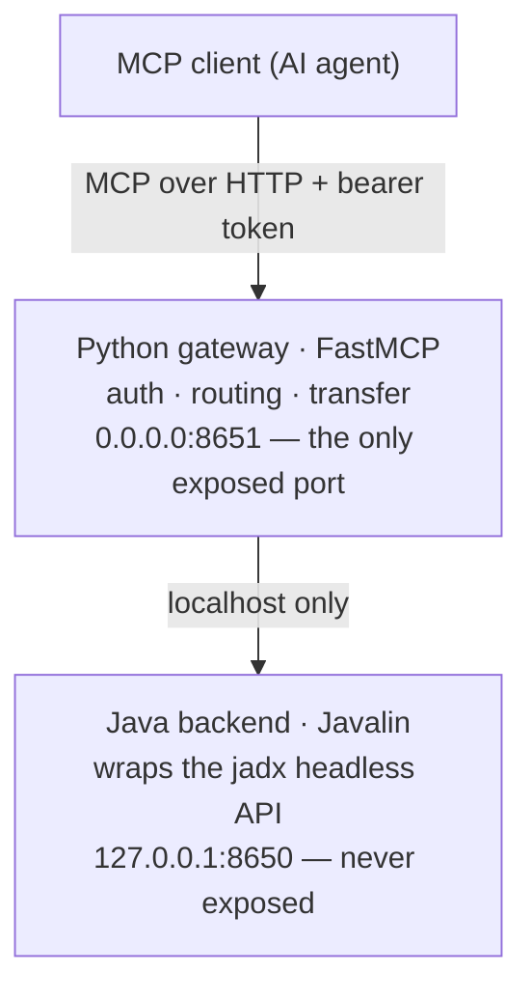

[English](README.md) · **简体中文**

# delamain

> Leave the reversing to us.（把逆向工程交给我们。）

[](LICENSE)

**delamain** 是一个 **MCP server**，把 [JADX](https://github.com/skylot/jadx)
的全部能力开放给 AI agent —— 一座**无头（headless）、高性能、低内存的桥梁**，
用于 AI 驱动的 Android 逆向工程。

`JADX` · `MCP (Model Context Protocol)` · `Android 逆向工程` ·
`APK / DEX / AAB 反编译器` · `AI agent` · `headless` · `Frida`

---

## 这是什么？

delamain 让 AI agent 能够*直接驾驭* JADX。把它指向一个 APK（或任何 jadx
接受的其他输入），agent 就能反编译类、搜索代码与字符串、追踪交叉引用
（cross-references）、调用图与数据流，查看资源文件与 manifest，生成 Frida
hook，运行安全扫描，以及重命名/添加注解 —— 这一切都通过**专为 AI 消费设计
的 MCP 工具**完成，而不是为了给人类点击 GUI。

它只是无头引擎：delamain **不**自带分析"智能"。AI 是分析师，delamain 是它的
仪器。

## 支持的输入

delamain 直接封装 jadx，因此 jadx 接受的输入它都接受：

- **Android 应用及其分发格式** —— `.apk`、`.apks`、`.xapk`、`.apkm`、
  `.aab` —— **已加载并测试**。这是 delamain 的首要目标场景。
- **jadx 支持的其他 JVM 字节码格式** —— `.jar`、`.dex`、`.aar`、`.class`、
  `.zip` —— 通过 jadx 反编译。

关于范围的说明：**反编译 / 搜索 / 交叉引用**这个核心能力对上述任何输入都适
用，但 delamain 的**上层工具**（Android manifest、资源文件、Frida hook 生
成、攻击面/安全扫描）是 **Android 专属**的，测试也聚焦在 Android/APK 上。
纯 JVM 输入（例如 `.jar`）经 jadx 可以正常反编译，但不是当前的重点。

## 为什么选 delamain（而不是自己驱动 jadx）？

- **为 AI 优化的工具接口。** 每个工具都返回**有边界、分页**的输出，绝不会
  淹没模型的上下文窗口。图遍历带有硬性的节点数/深度预算和 `truncated`
  标志。`get_class_source` 会报告 `decompile_quality` 信号，让 agent 知道
  何时该回退到 smali。
- **无头（headless）且低内存。** 可在没有显示服务器的服务器、CI 或边缘设
  备上运行。一个基于 mmap 的分片索引，配合持久化的磁盘 CodeStore，让它能在
  普通内存下加载和搜索非常大的 APK。
- **带外（out-of-band）文件上传。** 直接把大体积 APK 交给服务器 —— 它的字
  节永远不会经过 AI 的上下文窗口。
- **单一融合容器，单一暴露端口。** 部署简单又安全。

## 架构



Java 后端（`com.zin.delamain`）封装了 jadx 的无头 `JadxDecompiler`，负责反
编译、索引与搜索。Python 网关是唯一对外可达的接口：它负责认证 MCP 客户端、
把调用代理给后端、并流式处理带外文件上传。两者打包在同一个融合 Docker 镜像
中。详见 [`docs/architecture-reference.md`](docs/architecture-reference.md)。

## 快速开始（Docker）

```bash
# 1. 把要分析的 APK 放进一个目录，例如 /data/apks
# 2. 设置至少一个 MCP 客户端 token（逗号/换行分隔的白名单）
export DELAMAIN_AUTH_TOKENS="$(openssl rand -hex 32)"

docker compose up -d       # 构建融合镜像，暴露 127.0.0.1:8651

curl -s http://127.0.0.1:8651/health
# → {"status":"healthy","version":"…","jadx_version":"1.5.6"}
```

用上面的 bearer token 把你的 MCP 客户端指向 `http://<host>:8651/mcp`。然后
对挂载目录下的一个 APK 执行 `load_file`（或通过
[带外上传流程](docs/file-upload.md)推送一个），即可开始分析。

关于从源码构建以及开发者工作流，见 [`docs/dev-guide.md`](docs/dev-guide.md)。

## 配套 CLI：`delamain-cli`

对于大到无法放进挂载目录的 APK，delamain 提供了一个可选的、可续传、分块、
带校验和的上传工具，能把文件字节直接流式传给服务器（永远不经过 AI 的上下
文）。可以从 [Releases](https://github.com/xjoker/delamain/releases) 页面
获取适配你平台的预编译二进制，也可以从源码构建：

```bash
cd tools/delamain-cli
cargo build --release   # 二进制位于 target/release/delamain-cli
```

用法以及完整的传输流程（如何与 `create_transfer_token` MCP 工具配合使用）
记录在 [`docs/file-upload.md`](docs/file-upload.md) 和
[`tools/delamain-cli/README.md`](tools/delamain-cli/README.md) 中。

## 配置

配置来自环境变量和/或可选的 `config.toml`（环境变量优先）。复制
[`config.toml.example`](config.toml.example) 作为起点。

| 键 | 用途 |
| --- | --- |
| `DELAMAIN_AUTH_TOKENS` | MCP 客户端 token 白名单（必填）。列表中的任意 token 都拥有完整访问权限 —— 请把每一个都当作共享密钥对待，长度 ≥32 个随机字符。 |
| `JADX_FILE_ROOT` | `load_file` 与上传操作的沙箱根目录（镜像内默认为 `/apks`）。 |
| `JADX_TRANSFER_MAX_MB` | 带外上传的最大体积（默认 1024）。 |
| `JADX_CACHE_MAX_GB` | 磁盘反编译索引缓存的 LRU 配额（默认 50；`0` 表示禁用淘汰）。 |

## 工具总览

delamain 提供以下几大类工具：**反编译**（类/方法源码、smali、
`decompile_with_mode`、`get_decompile_diag`）、**搜索**（类/方法/字段、字
符串字面量、native 方法、索引化代码搜索）、**图分析**（交叉引用、调用者/
被调用者链、调用图导出、数据流追踪）、**资源**（manifest、资源文件/ID、配
置字符串）、**Frida**（hook/trace/enum 生成 —— 始终输出*原始*的混淆名
称）、**安全**（攻击面、安全扫描）、**重构**（重命名、ProGuard/重命名映
射）、**会话与注解**，以及**文件传输**。

在客户端调用 `get_jadx_guide(verbose=True)` 可获取完整的工作流指南。

## 内置的 jadx

delamain 内置了 **jadx-all**（[jadx](https://github.com/skylot/jadx) 反编
译器），其许可证为 Apache-2.0，© skylot 及贡献者。详见
[`NOTICE`](NOTICE)。delamain 使用了 jadx 的公开与内部无头 API；它是一个独
立项目，与 jadx 作者没有从属或背书关系。

## 许可证

基于 [Apache License 2.0](LICENSE) 授权。
