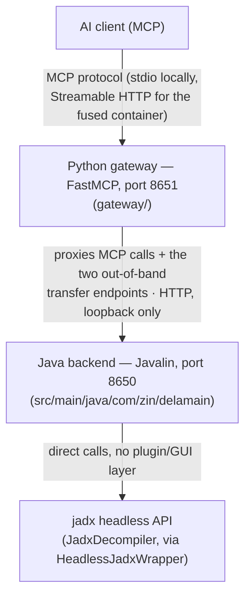

# Architecture reference

How delamain is put together: two processes, one exposed port, and the
on-disk index layout that makes a multi-hundred-thousand-class APK usable
from a memory-constrained host.

## Two-process, one-port shape

The fused Docker image (`docker/Dockerfile`) runs both processes and exposes
only 8651; the Java backend binds `127.0.0.1:8650` and is unreachable from
outside the container.

There is no display server, no GUI process, and no plugin-host lifecycle —
`Main.java` is a plain `public static void main` that parses CLI flags
(`--port`, `--auth-token`, `--apk`, `--output-dir`, `--index-dir`,
`--workers`, `--bind`), builds a `HeadlessJadxWrapper` directly against
jadx's `JadxDecompiler`, and starts `DelamainServer`.

## Java backend (`com.zin.delamain`)

| Package | Responsibility |
|---|---|
| `core` | `HeadlessJadxWrapper` (wraps `JadxDecompiler`), `MultiFileLoader` (extension allowlist, multi-file load), `RenameStorage` (persisted rename mappings, no GUI project file involved) |
| `server` | `DelamainServer` (Javalin app: thread pool, auth middleware, load-state middleware, OOM handler, route registration), `AuthConfig`, `TransferTokenStore` |
| `server.routes` | One `*Routes.java` class per feature area: `ClassRoutes`, `MethodRoutes`, `SearchRoutes`, `XrefsRoutes`, `AnalysisRoutes`, `AnnotationRoutes`, `ApkInfoRoutes`, `BatchRoutes`, `DecompileRoutes`, `FileManagementRoutes`, `FridaRoutes`, `GeneralRoutes`, `MemoryConfigRoutes`, `RefactoringRoutes`, `ResourceRoutes`, `TransferRoutes` |
| `index` | The on-disk/in-memory index stack — see below |
| `utils` | `FilePathSandbox` (upload/load path confinement under `JADX_FILE_ROOT`), `CodeSearchCoordinator` (async search tickets), `JadxSearchLock`, `ClassCacheManager`, `PaginationUtils`, `SmartChunker`, `TicketRegistry`, `FridaTypeConverter`, `ManifestInfoService`, `AppVersion` |

`DelamainServer.start()` builds a bounded Jetty thread pool, installs auth
and load-state middleware, registers every route class, installs an OOM
handler, and only then calls `app.start(port)` — routes are fully registered
before the socket accepts connections, closing a race where an early gateway
poll could hit a partially-registered route table.

Two path sets get special auth treatment:
- `NO_FILE_REQUIRED_PATHS` — endpoints that must respond even before any
  APK is loaded (`/health`, `/apk-info`, `/decompile-status`,
  `/memory-config`, `/list-available-files`, `/load-file`,
  `/create-transfer-token`, `/transfer/upload`, `/transfer/status`).
- `TRANSFER_TOKEN_AUTH_PATHS` (`/transfer/upload`, `/transfer/status`) —
  authenticate via their own one-time `X-Transfer-Token` header instead of
  the standard bearer token, because an upload client (e.g. `curl` or the
  `delamain-cli` CLI) may hold nothing else. `/create-transfer-token` itself
  still requires the normal bearer token.

## Index stack (`index/`)

Built to let a large APK (hundreds of thousands of classes) be searched and
decompiled without the memory blow-up of holding everything in JVM heap:

- **`CodeContentIndex`** — an in-memory trigram inverted index over
  decompiled source, used for fast `code`/`comment` search hits.
- **`CodeStore`** — persisted decompiled source, keyed by class, so a
  restart doesn't require re-decompiling everything on disk.
- **`UsageGraphIndex` / `UsageGraphStore`** — the class/method usage graph
  (xrefs, callers/callees) and its on-disk form (`.graph` files).
- **`UsePlacesIndex` / `UsePlacesStore`** — precise reference locations
  (`.useplaces` files), used when xref results need exact call sites rather
  than just "class X uses class Y".
- **`index.shard`** (`ContentShard`, `ContentShardBuilder`,
  `ContentShardIndex`, `ShardCatalog`, `TermLookupResult`) — the mmap'd
  on-disk shard layer (`.shard.N` files plus a `.shardcat` catalog). Shards
  are memory-mapped, read-only, and **do not consume JVM heap**, which is
  what keeps code search available on low-heap hosts where a purely
  in-memory trigram index would otherwise have to be skipped under memory
  pressure.
- **`PersistentIndexStore`**, **`IndexCacheManager`** — coordinate loading
  an existing `--index-dir` on startup (`FAST_RESTORE`: if the directory
  already has a complete, hash-matched index for the loaded APK, startup
  skips the full Phase-1 decompile + index build) and writing a new one
  after warmup. See `docs/prebaked-index.md` for the operational workflow
  (building an index volume on a large-heap host, shipping it to a
  low-spec one, and verifying it's complete via `/index-stats`).
- **`WarmupManager`** — drives the background warmup: Phase 1 (parallel
  decompile across `--workers` threads) then Phase 2 (trigram index build).
  The server serves requests during warmup; capability coverage opens up
  progressively as `WarmupManager` reports phase and percentage.
- **`MemoryConfig`** — heap-aware tuning knobs (e.g. trigram cap) so the
  index stack degrades predictably instead of OOMing on constrained hosts.

`CodeSearchCoordinator` and `TicketRegistry` (in `utils`) implement the
submit/poll ticket pattern for anything that can take longer than a single
HTTP request is willing to wait — security scans, callgraph export, code
search over a cold index — so the Java backend never blocks a request for
longer than a bounded ticket TTL.

## Python gateway (`gateway/`)

A FastMCP server (`gateway/main.py`) that is the *only* externally reachable
process. It is intentionally a thin proxy: almost every tool's
implementation is `await get_from_jadx(endpoint, ...)`, an HTTP call into
the Java backend at `127.0.0.1:8650`. Structure:

| Path | Responsibility |
|---|---|
| `src/tools/` | One MCP tool module per feature area (`class_tools`, `search_tools`, `xrefs_tools`, `resource_tools`, `string_literal_tools`, `refactor_tools`, `annotation_tools`, `analysis_surface_tools`, `dataflow_tools`, `security_tools`, `frida_tools`, `digest_tools`, `export_tools`, `workflow_tools`, `instance_tools`, `session_tools`, `task_tools`, `diagnostics_tools`, `decompile_tools`, `file_management_tools`, `init_tools`); `tools/__init__.py:register_all_tools()` wires them all into the `FastMCP` instance. |
| `src/config/` | TOML config loading (`config_loader.py`), env-over-TOML precedence |
| `src/auth/` | MCP client bearer-token auth (`build_auth_provider`) — every listed token grants identical full access; there is no per-token role in this single-user gateway |
| `src/registry/` | `InstanceRegistry` holding the single fixed JADX backend this gateway proxies to |
| `src/routing/` | Request-routing helpers (shared `httpx` client, sanitized error mapping) used by the tool layer |

`gateway/main.py` documents its own deployment guardrail directly in its
module docstring: the process holds singleton in-memory state (one
`InstanceRegistry`, one shared `httpx.AsyncClient`, one busy-tracker table)
and assumes exactly one asyncio event loop for its lifetime — always run it
with a single uvicorn worker, never `workers=N` or a multi-worker process
manager, or that state silently forks into inconsistent copies.

## Out-of-band file transfer

Large APK/JAR/AAR/DEX uploads never pass through the AI's context window:
`create_transfer_token` hands back a one-time token, and the human (or the
`delamain-cli` CLI in `tools/delamain-cli/`) PUTs raw bytes straight to
`PUT /transfer/upload` on the gateway, which proxies to `TransferRoutes.java`
on the Java backend. Full protocol, headers, TTL, size caps, and sandbox
rules are documented in `docs/file-upload.md`.

## Authentication model

Two independent bearer tokens, matching the two tiers:

- **Java backend** (`DELAMAIN_AUTH_TOKEN` / `--auth-token`) — required for
  every route except the `NO_FILE_REQUIRED_PATHS` set and the two
  transfer-token-authenticated paths above. `AuthConfig` resolves the token
  in priority order: CLI flag → env override → a token persisted at
  `~/.delamain/auth.properties` → a freshly generated random token as a
  last resort.
- **Gateway/MCP client** (`DELAMAIN_AUTH_TOKENS`, comma/newline separated,
  merged with `[server] allowed_tokens` in `config.toml`) — required by any
  MCP client calling the gateway. There is
  no per-token identity or role: any accepted token grants full access to
  every tool.

In the fused container, only the gateway's token is ever presented to the
outside world; the Java backend's token secures the internal
loopback-only hop between gateway and backend.

This internal hop's token (`DELAMAIN_AUTH_TOKEN` / `--auth-token`) is
generated by `docker/entrypoint.sh` and passed to *both* processes via
`--auth-token`, so CLI wins on both sides and the two always agree — the
gateway resolves it as CLI → `[defaults] jadx_token` in `config.toml` → env
`DELAMAIN_AUTH_TOKEN` (see `gateway/main.py:resolve_jadx_token()`), matching
Java's own CLI-first priority above. Do not set `DELAMAIN_AUTH_TOKEN`
yourself in the fused container: since `--auth-token` is always already set
there, the env var would be ignored on both sides anyway, and doing so
invites confusion rather than fixing anything.
